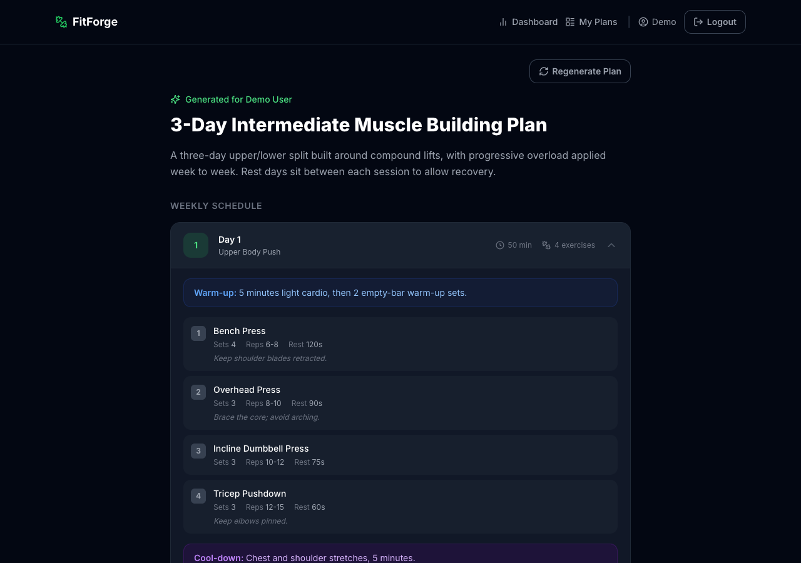
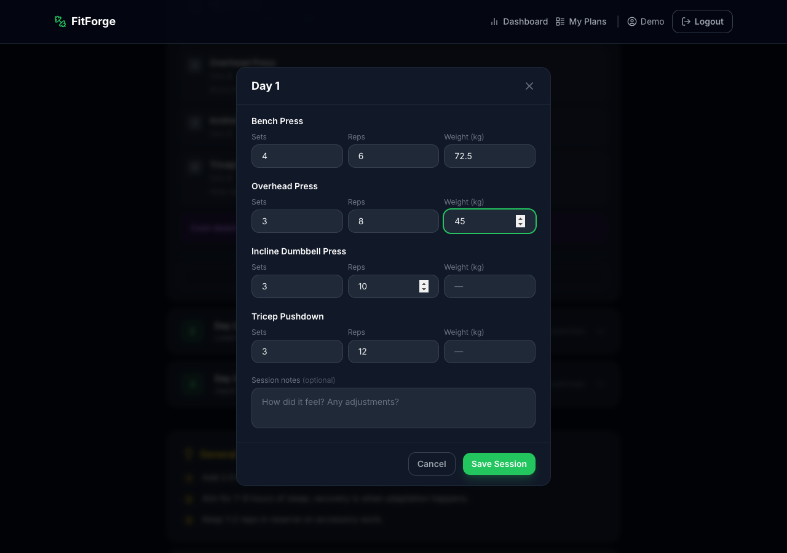
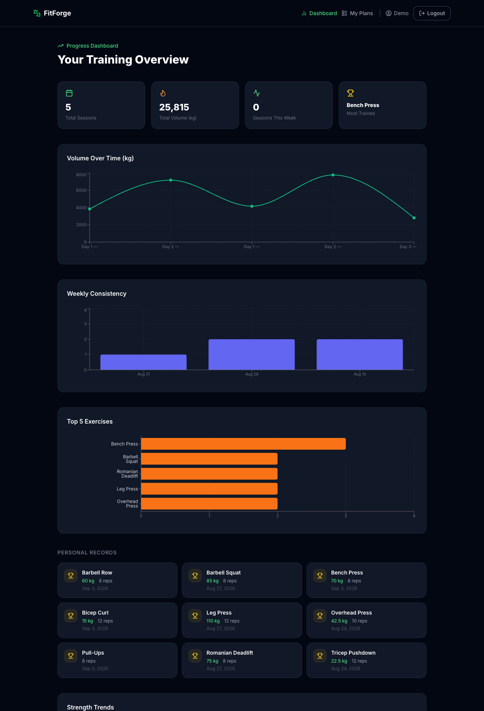
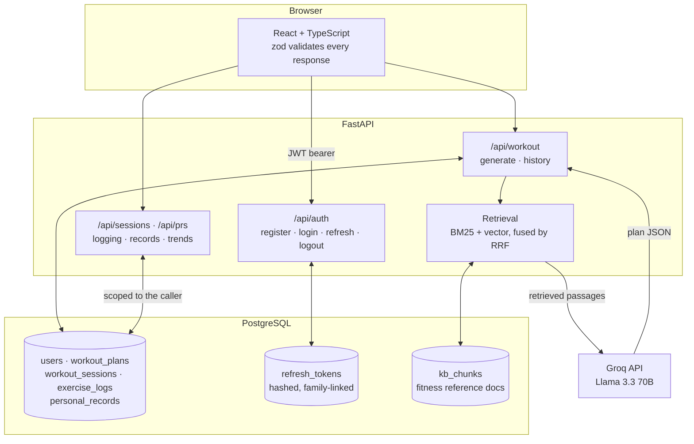

# FitForge

[](https://github.com/meetsutariya4448/fitforge/actions/workflows/ci.yml)

FitForge turns a few answers about your goals and equipment into a structured
weekly workout plan, then tracks whether you actually did it. You log each
session set by set; the app maintains your personal records and charts how your
training volume moves over time. Plans are generated by a language model
grounded in fitness reference material and saved for later.

**Stack:** TypeScript · React · FastAPI · PostgreSQL (SQLAlchemy, Alembic, pgvector) · Playwright · Vitest · pytest

---

## What it looks like



A saved plan. Each day expands to show exercises with sets, reps, rest and form
notes; "Log This Workout" opens the logging form pre-filled from that day.



The logging form. Adjust the pre-filled sets and reps and add weight per
exercise. Weight is optional, so bodyweight work is not recorded as 0 kg.



The dashboard: volume over time, weekly consistency, most trained exercises,
and a personal record for every exercise logged.

> Screenshots come from the running app with seeded demo data
> (`scripts/seed_demo.py`); the plan shown was inserted as demo content rather
> than generated live.

---

## Core workflows

**Build a plan.** A five-step form collects your goal, level, equipment and
training days, validated in the browser and again by the API.

**Log a workout.** Record what you did against any day of a plan. Sets and reps
are required; a cleared field blocks the save rather than submitting zero.

**Track progress.** Personal records update when you beat a previous best.

**Revisit past plans.** Plans reopen from "My Plans" without another model call.

### What the AI can and cannot see

Generation retrieves passages from a **curated knowledge base of ten fitness
reference documents** (progressive overload, ACSM guidance, nutrition,
recovery). Those passages go into the prompt and the model is asked to cite
them; plans carry a `grounded` flag and citations.

Retrieval **does not read your logged workouts, records or past plans**. The
request schema has an optional `session_history` field, but the web app never
populates it — so generation sees only your onboarding answers and the
knowledge base.

---

## How it works



Login returns a short-lived JWT access token plus a long-lived refresh token.
The client attaches it to every request; on a `401` it redeems the refresh token
once and replays the original request. Retrieval reads only `kb_chunks` — no
arrow connects it to user data.

---

## Engineering highlights

**Refresh-token rotation under concurrent requests.** Redemption used to read
the row, check it, then write, so simultaneous requests all passed the check
before any committed — eight concurrent redemptions of one token produced up to
eight valid replacements. It is now one conditional
`UPDATE ... WHERE revoked_at IS NULL ... RETURNING`: the database picks a single
winner and mints the replacement in the same transaction. Eight threads on eight
connections assert exactly one succeeds.

**Race versus replay.** Two tabs can legitimately submit the same token at once,
so treating every second use as theft would sign people out for opening a tab.
Tokens carry a family ID — a replay within ten seconds returns `REFRESH_RACE`
and the client waits for the winning tab's token; a later replay revokes the
family.

**Runtime validation at the API boundary.** TypeScript checks nothing at
runtime, so a renamed backend field would surface as an unrelated crash. Every
response is parsed through a zod schema, and CI diffs those schemas against the
backend's OpenAPI document so drift fails the build.

**User-scoped queries.** Session, record and plan reads all filter on the
authenticated user; fetching another user's session returns `403`.

---

## Quick start

Requires Python 3.11, Node 18+, and Docker (or a local PostgreSQL with the
`pgvector` extension available).

```bash
git clone https://github.com/meetsutariya4448/fitforge.git
cd fitforge

# 1. Database
docker compose up -d db

# 2. Backend
cd backend
cp .env.example .env          # then edit DATABASE_URL, SECRET_KEY, GROQ_API_KEY
python -m venv venv && source venv/bin/activate
pip install -r requirements.txt
alembic upgrade head
python -m scripts.seed_demo   # demo account with 5 sessions and 9 records
uvicorn app.main:app --reload --port 8000

# 3. Frontend (new terminal)
cd frontend
npm install
npm run dev                   # http://localhost:5173, proxies /api to :8000
```

Sign in with `demo@fitforge.app` / `Demo1234!`, open **My Plans**, expand a day,
choose **Log This Workout**, then check **Dashboard**. To stop: `Ctrl-C` both
servers, then `docker compose down` (`-v` also discards the volume).

**Credentials.** `SECRET_KEY` can be any random string locally. `GROQ_API_KEY`
([console.groq.com](https://console.groq.com)) is needed only to generate new
plans — sign-in, logging, history and the dashboard work without it.

---

## Testing and scope

At commit [`d8514d0`](https://github.com/meetsutariya4448/fitforge/commit/d8514d0)
on `main`, all five CI jobs passed: backend unit and integration tests, frontend
typecheck and component tests, browser tests, and the schema contract check.

- **Backend (113 tests, integration against real PostgreSQL).** Auth lifecycle
  and account deletion; cross-user boundaries — user B sees an empty session
  list, gets `403` on user A's session, and cannot see their records;
  personal-record upsert boundaries; cursor pagination; and a clean `5xx` when
  the model client raises.
- **Concurrent redemption.** Eight threads on eight PostgreSQL connections
  redeem one token at once; the test asserts one success, one surviving token.
- **Frontend (25 component, 17 browser tests).** Playwright covers login, plan
  generation, logging, history, silent refresh, cross-tab rotation races and
  graceful API failure.

**Limitations.** Browser tests use a mocked API — that is what lets them force a
lost rotation race or a dropped connection; one opt-in spec drives the real
stack and is skipped in CI. Test counts are not coverage. The
crash-between-consume-and-replace case is handled structurally, not
fault-injection tested. Generation faithfulness averaged 0.59 over 12 queries,
which is weak and unresolved. The hosted demo is unverified and its build
predates this work, so local setup is the supported path. No usability testing
has been run.

---

## Further reading

- [API reference](docs/api.md) — endpoints and payloads (also at `/docs` when running)
- [Evaluation results](backend/eval/results.md) — 30-query retrieval benchmark, five strategies
- [Self-reflection agent](docs/agent.md) — implemented and tested, not wired into the UI
- [Project structure](docs/project-structure.md)
- [Usability testing protocol](docs/usability-testing.md)

---

MIT — built by [Meet Sutariya](https://github.com/meetsutariya4448) as a portfolio project.
